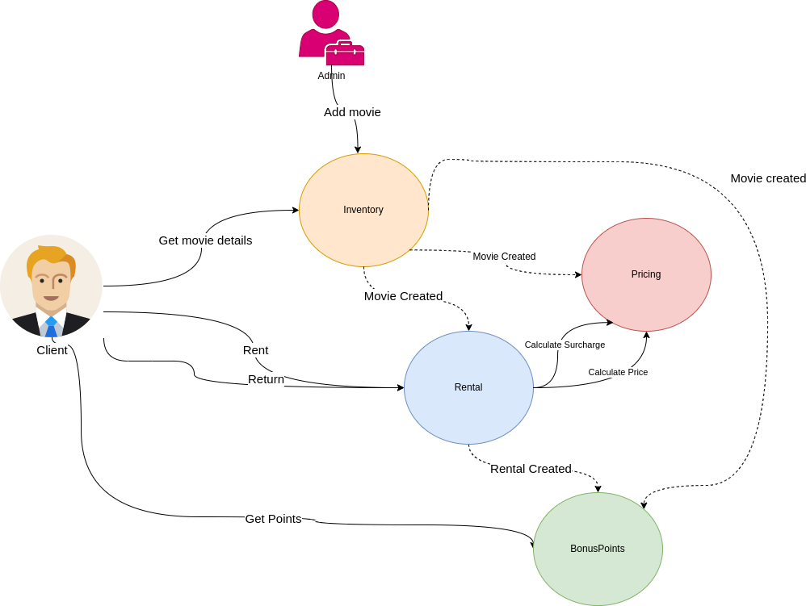

# Welcome to the Video Rental Store!

> A demonstration app built to present Hexagonal(Clean/Port&Adapters) Architecture approach.

## Overview

As mentioned, this repository is meant to show off a key techniques. It has only a demonstration and educational
purpose.
The code is far from being called production, many oversimplifications have been used.
The theoretically background can be found on the [blogpost](https://javacaptain.com/2024/01/11/hexagonal-architecture-made-simple-practice/)

### Basic Concepts

* Modular monolith with modularization on package level. That provides high cohesion, low coupling
  and great options for a journey to microservices.
* Each so-called bounded context represents a separate package. Each of them contains the following structure:
    * __api__: contains all the DTOs, value objects, required for communication with external world
    * __domain__: contains all the business objects
    * __infrastructure__: contains the implementation "Details"; the interface implementations responsible for actually
      communicating with external systems, performing I/O, etc... as well as supporting classes necessary to make that
      work.
    * __web__: contains controllers and other classes necessary to fulfill the http communication

All dependencies should point 'inward', that is, everything depends on `domain`, but `domain` has no knowledge of the
other components.

### Encapsulation and Isolation

Concerns of the bounded context should be contained within the single module.

* Modules should not share any data with each other. Unfortunately, in this project, a common package was created to
  avoid additional mapping, just to save time. However, the principle of `location transparency` has been kept.
* The modules are loosely coupled. They do not have shared database tables. Each works on its own set of information,
  which sometimes happens to be a copy of data from another module.

### Conscious decision:

- Skipped API authentication/authorization.
- Skipped entire client management domain
- Only the current number of customer points is presented.
- Simple Money representation. I am aware that money is a delicate matter, and extra care is needed when dealing with it
  in production software.

### Build and Run
- Make sure you're using at least Java21
- Make sure postgres db is up and running on port 5432 (You can use `docker-compose.yml`)
- Use a standard `./gradlew bootRun`
